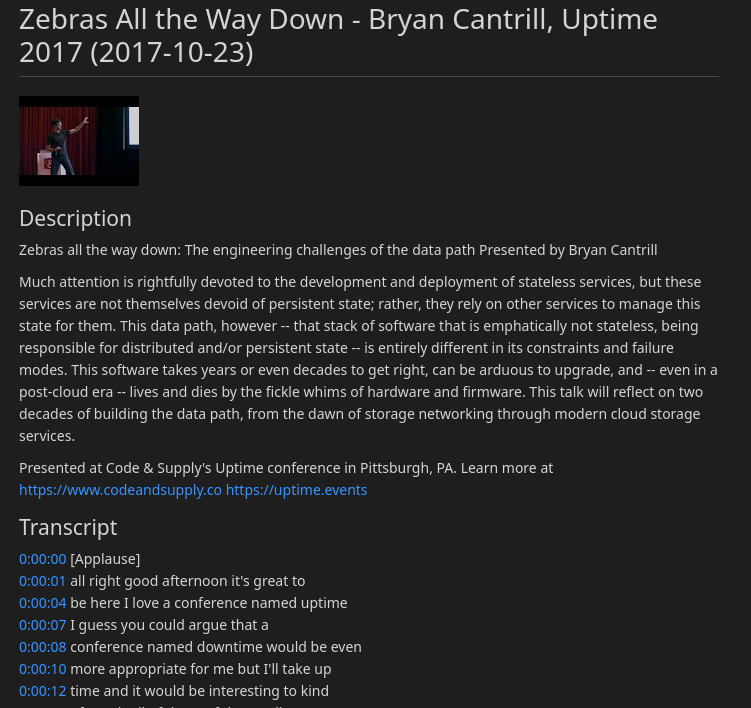

# talk-scriber

Download transcripts and metadata from youtube and spit them out as markdown.

## Installation

```bash
pip install git+https://github.com/gentoomaniac/talk-scriber
```

## Run

Get your [Youtube API token](https://developers.google.com/youtube/v3/getting-started)

```bash
export YOUTUBE_API_KEY=secretapitoken

# the video ID can be extracted from teh video URL, the v= parameter
talk-scriber scribe --video-id youtube_id > transcript.md
```

## Example

A rendered page looks like this.


